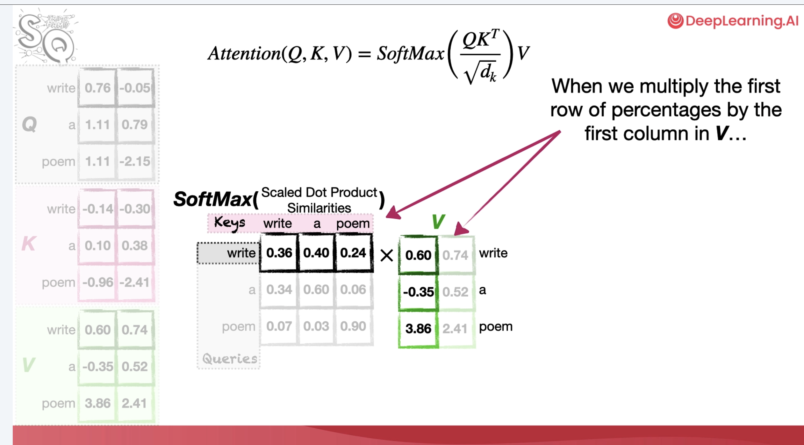

If you are like me, an engineer who builds systems but is also curious and wants to understand all the mathematical details behind ML models, you would definitely want to understand the mathematical details of attention in transformers, arguably the most important AI/ML theory in history so far.

At the diagram level, the idea sounds straightforward: tokens look at other tokens and decide what matters, but it is not easy to understand or get the intuition of it from the mathematical perspective.

After going through a number of explanations, these are the resources I would recommend.

## 1. Attention in Transformers: Concepts and Code in PyTorch

My top recommendation is [Attention in Transformers: Concepts and Code in PyTorch](https://www.deeplearning.ai/courses/attention-in-transformers-concepts-and-code-in-pytorch/) from DeepLearning.AI, taught by Josh Starmer from StatQuest.

The reason it works better than most explanations I have seen online is that Josh uses small mock examples to show how embedding values change across the computation. To me, this is really intuitive. You are not only told that attention creates context-aware embeddings; you can follow how the numbers move from token embeddings, to queries/keys/values, to attention scores, to softmax weights, to the weighted sum that becomes the next representation.

_Screenshot from DeepLearning.AI's Attention in Transformers: Concepts and Code in PyTorch._

That makes the math feel less like notation and more like dataflow.

One caveat: to really understand Josh's content, you still need some basics in linear algebra, neural networks, and word embeddings. The explanation is beginner-friendly, but it is not magic. It works best if matrix multiplication, learned weights, and embedding vectors are at least familiar ideas.

Josh's course focuses on demonstrating the mathematical intuition behind the attention mechanism. Attention is a critical part of the transformer, but it is not the full picture of the transformer architecture. For that broader architecture view, I would go next to Jay Alammar.

## 2. The Illustrated Transformer

[The Illustrated Transformer](https://jalammar.github.io/illustrated-transformer/) by Jay Alammar is still one of the best visual explanations of the transformer architecture.

I would use it to build the high-level map: encoder, decoder, embeddings, positional information, self-attention, feed-forward layers, residual connections, and layer normalization. It is especially useful when you want to see where attention sits inside the full architecture rather than studying attention as an isolated formula.

## Additional Resources for Other Preferences

### The Annotated Transformer

[The Annotated Transformer](https://nlp.seas.harvard.edu/annotated-transformer/) is useful if you prefer learning from code and implementation notes. It is more demanding, but helpful once Q, K, V, masking, and multi-head attention are already familiar.

### Attention Is All You Need

[Attention Is All You Need](https://arxiv.org/abs/1706.03762) is worth reading if you want to connect the tutorials back to the source. I would not use it as the first explanation, but it becomes much easier after the concepts have somewhere to land.

## Final Note

The core mental model I keep coming back to is this: attention is learned retrieval over token representations. The output is not the attention score itself; it is a new embedding that has absorbed context from other tokens.

That is the part worth making concrete. If you know another good article or video that explains attention intuitively, feel free to add it in a [GitHub Issue](https://github.com/Blake-Guo/personal-blog/issues), and I am happy to update this list and share it.
